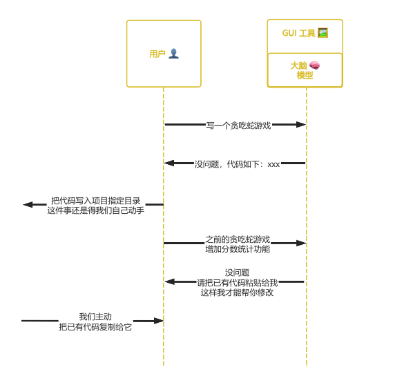
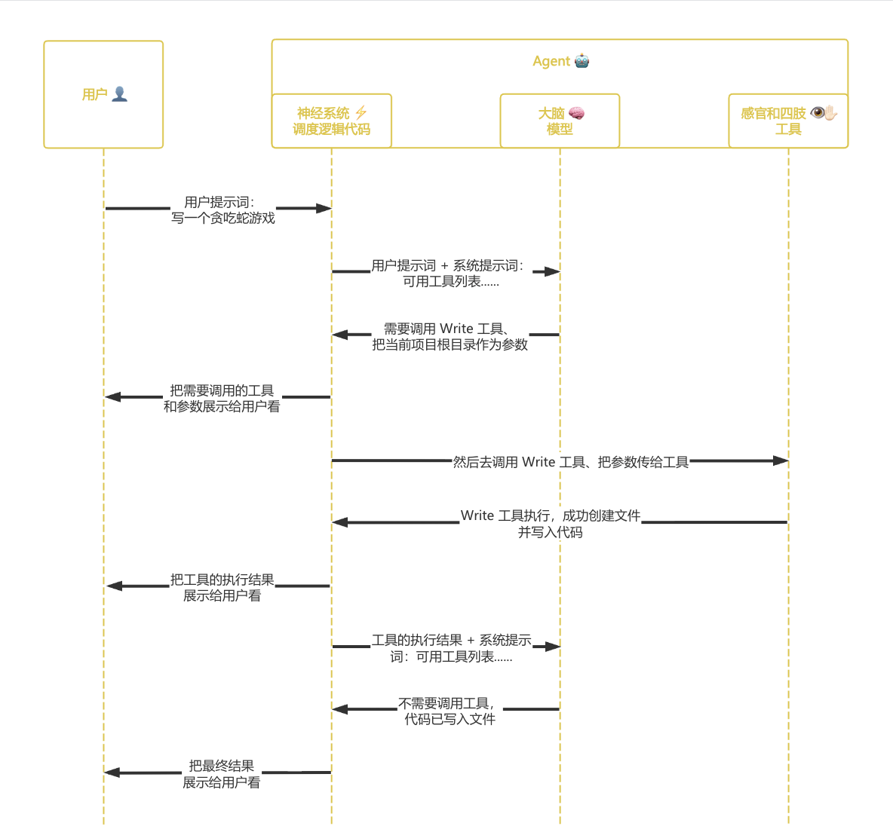

## ✅ 一、Claude --> 模型🧠

> 📅 2023 年 3 月 Anthropic 首次推出 Claude

#### 1、Claude 是什么

Claude 是一个大语言模型（LLM）家族，包括 Claude Haiku、Claude Sonnet、Claude Opus 模型：

| 模型       |                |        |                                                            |
| ---------- | -------------- | ------ | ---------------------------------------------------------- |
| **Haiku**  | 速度快、费用低 | 智慧低 | 定位是轻量入门模型 适合**简单问答**、有限上下文分析   |
| **Sonnet** | 速度中、费用中 | 智慧中 | 定位是均衡主力模型 适合**大多数日常问答**、长下文分析 |
| **Opus**   | 速度慢、费用高 | 智慧高 | 定位是顶级旗舰模型 适合**复杂推理问答**、长下文分析   |

#### 2、Claude 的特点

* **模型本身只会问答**（理解用户输入的文本，生成它认为高关联的文本）
* **模型本身无法感知和改变外部环境**（这里的外部指的是模型本身以外，环境是什么下面会提到）

## ✅ 二、Claude App --> GUI 工具🖼️

> 📅 2023 年 7 月 Anthropic 首次推出 Claude App

#### 1、Claude App 是什么

Claude App 是一个 GUI 工具——一个可交互的聊天窗口，以便“普通用户”能跟 Claude 模型聊天，如果用于编程，也仅仅是片段级的辅助编程。Claude App 充分发挥了**模型本身只会问答**的能力，但没有解决**模型本身无法感知和改变外部环境**的问题（当然随着版本迭代，Claude App 逐渐内置了文件读写 Artifacts、联网搜索 WebSearch、自主多步骤研究 DeepResearch 等工具，已经由一个纯粹的聊天工具变成了一个轻量的 Agent，但这个 Agent 自主干活的程度有限，跟真正的 Agent 有不少差距）。

#### 2、Claude App 的流程

比如我们想让 Claude App 帮我们写一个贪吃蛇游戏：

* 我们给它发送“写一个贪吃蛇游戏”，它给我们回复“没问题，代码如下：xxx”，它确实可以帮我们写代码，但是把代码写入项目指定目录这件事还是得我们自己动手，这就是上面所说**模型本身无法改变外部环境**的一个体现
* 我们给它发送“之前的贪吃蛇游戏增加分数统计功能”，它给我们回复“没问题，请把已有代码粘贴给我，这样我才能帮你修改”，它确实可以帮我们改代码，但是如果我们不主动把已有代码复制给它、它自己是无法找到这些代码的，这就是上面所说**模型本身无法感知外部环境**的一个体现

## 三、Tool --> 函数💻

> 📅 2024 年 5 月 Anthropic 首次推出 Tool

#### 1、Tool 是什么

Tool 翻译过来是工具，本质上其实就是一个函数，它要解决的是**模型本身无法感知和改变外部环境**的问题

注意 MCP Server 不一定是操作远程服务器，也可以是操作本地。

比如 Claude Code 内置的工具有

* ① Grep：用来全文搜索内容，比如搜索某个函数名、变量名、错误信息出现在哪些文件里

* ② Glob：用来按文件名模式查找文件，比如 \*.dart、src/\*\*/\*.ts、\*\*/application-*.yml

* ③ Read：用来查看目录结构、读取文件内容、按行查看某一段代码

* ④ Write：用来创建新文件或直接覆盖写入文件

* ⑤ Edit：用来精准修改已有文件里的某一段内容，而不是重写整个文件

* ⑥ Bash | PowerShell：用来执行终端命令，比如 npm install、python main.py

* ⑦ WebSearch：用来联网搜索，比如查文档、API 用法

## ✅ 四、Claude Code --> Agent🤖

> 📅 2025 年 2 月 Anthropic 首次推出 Claude Code

#### 1、Claude Code 是什么

Claude Code 是一个运行在终端里的智能编程程序，它能够**自主**查询已有文件、理解我们的代码库，通过自然语言帮我们更高效地编程、**自主**把代码写入文件等，整个过程不需要我们插手、完全**自主**，它就是我们常说的编程 Agent——编程智能体，一个 Agent 由三大部分组成 **Agent🤖 ＝ 大脑🧠 ➕ 感官和四肢👁✋🏻➕ 神经系统⚡️**，也就是说：

* **Agent 相当于把【模型 + 一堆工具 + 调度逻辑代码】打包起来，真得像个人了、不限于问答还能自主干活**（模型负责问答、工具负责干活）
* **Agent 就能感知和改变外部环境了**（这里的外部指的是 Agent 本身以外）

| **Agent🤖**        | 我们可以把 Agent 看成是一个人                                |
| ----------------- | ------------------------------------------------------------ |
| **大脑🧠**         | **Agent 的大脑就是其背后所用的模型** 比如 CC 默认的模型就是 Claude 家族模型，当然我们也可以给它改用其它模型，CC 就是通过这些模型来理解文本、推理计划、生成文本 |
| **感官和四肢👁✋🏻** | **Agent 的感官和四肢就是工具** 比如 CC 内置的 Grep、Glob、Read 工具就相当于它的眼睛，通过这些工具 CC 就能够自主查询已有文件，CC 内置的 Write、Edit 工具就相当于它的四肢，通过这些工具 CC 就能够自主把代码写入文件 |
| **神经系统⚡️**     | **Agent 的神经系统就是这个智能编程程序本身的调度逻辑代码，开发一个 Agent 框架主要就是在写这部分代码** 比如 CC 的调度逻辑代码下面会提到 |

#### 2、Claude Code 的流程

比如我们想让 CC 帮我们写一个贪吃蛇游戏：

* 任务会首先到达神经系统，神经系统会把当前任务（这部分就是用户提示词） + 可用工具列表（这部分会放在系统提示词里）一起发给模型，模型会分析处理当前任务需不需要调用工具，这一步称为**思考 Thought**
* 不需要调用工具的话，模型会直接生成文本然后发给神经系统，流程结束，这一步称为**最终答案 Final Answer**
* 需要调用工具的话，模型会告诉神经系统需要调用什么工具、该给工具传递什么参数，神经系统会调用相应的工具、把参数传给工具，这一步称为**行动 Action**
* 工具执行过程中，神经系统会一直监听工具的执行结果，工具执行结束后，神经系统会读取工具的执行结果，这一步称为**观察 Observation**
* 神经系统会把本轮工具的执行结果 + 可用工具列表一起再次发给模型，模型会再次分析当前任务需不需要调用工具......

**调度逻辑代码的核心其实就是“思考 --> 行动 --> 观察 --> 思考 --> 行动 --> 观察 --> ...... --> 最终答案”这么一套循环**