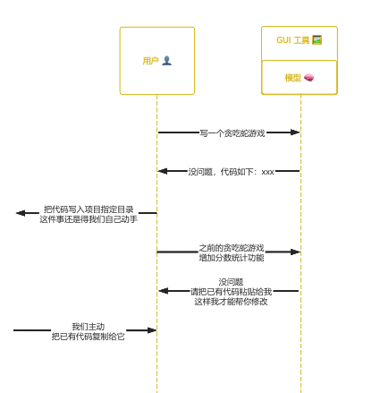
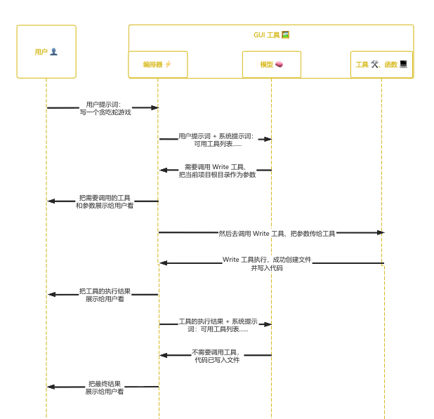
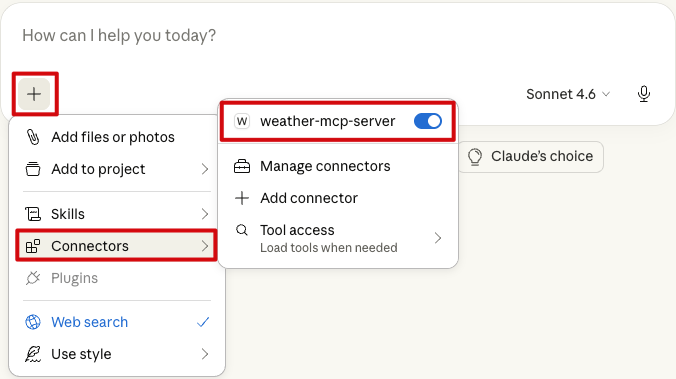
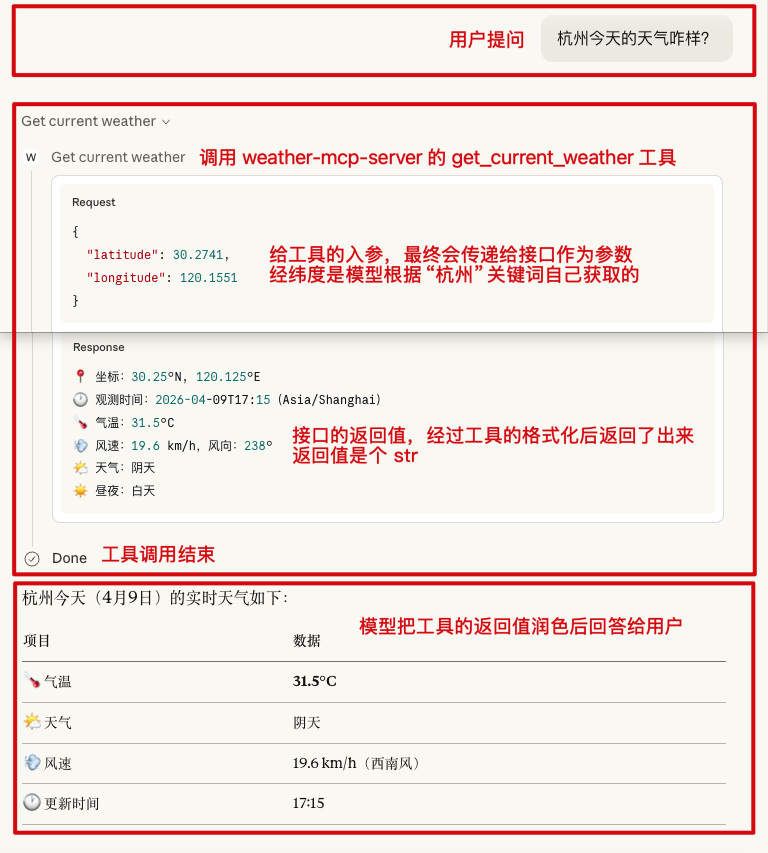
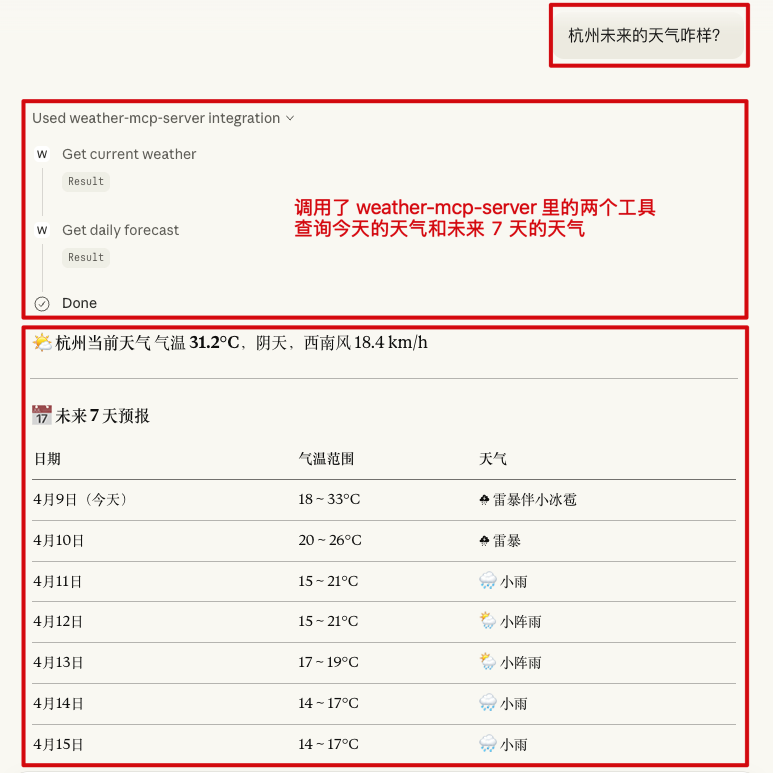
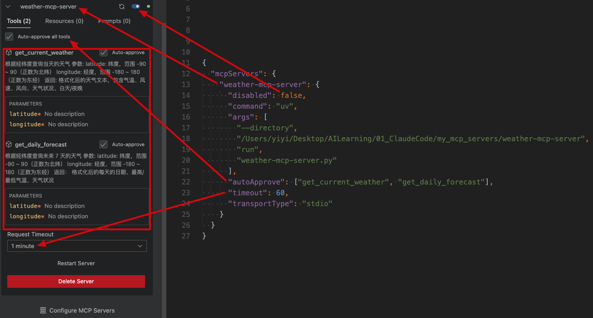
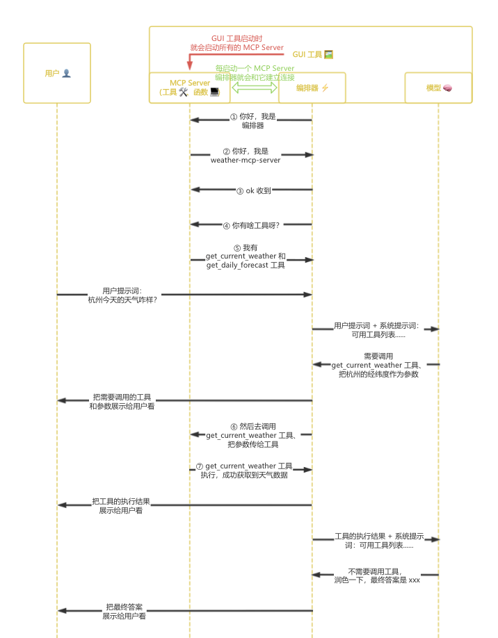
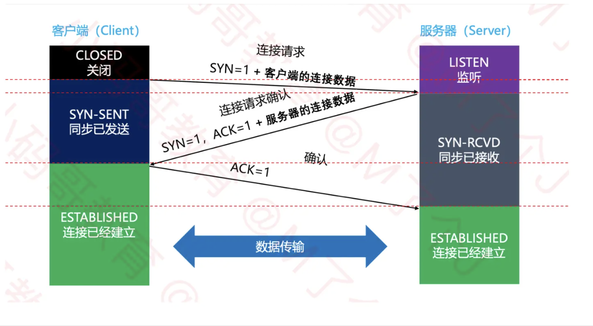
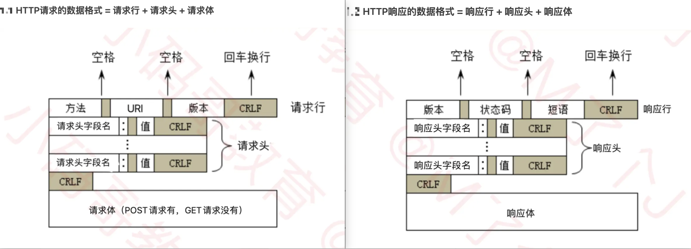
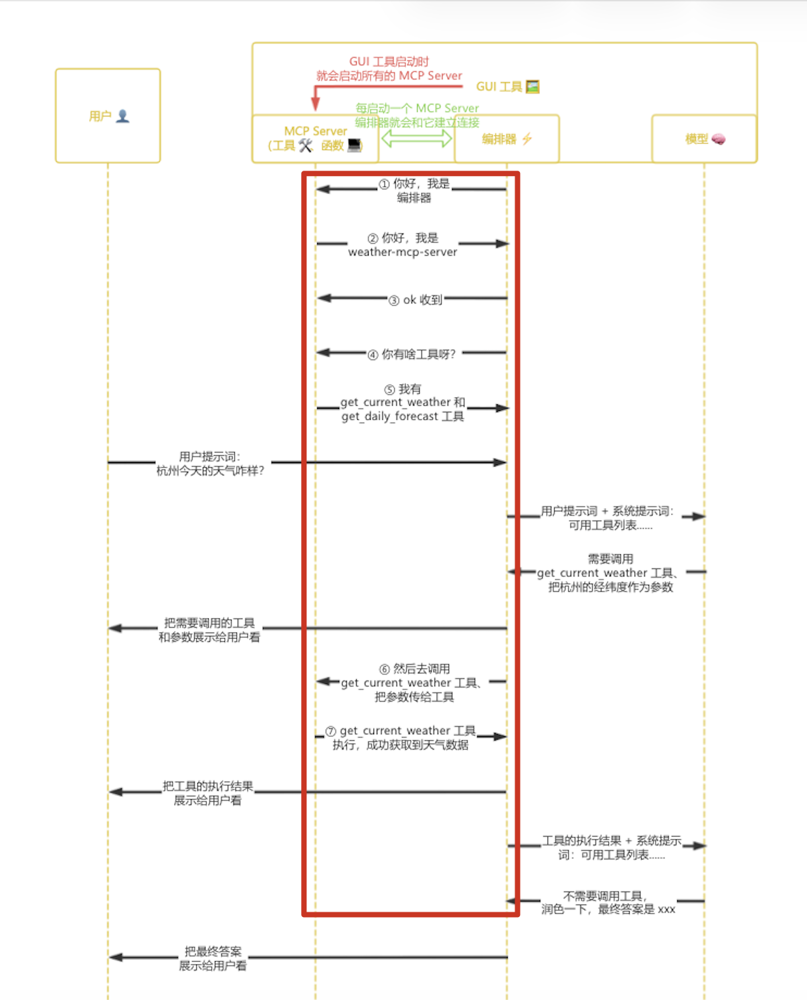

> 这一篇只回答**“是什么”**的问题

## 一、Claude --> 模型🧠（2023.03）

> 📅 2023 年 3 月 Anthropic 首次推出 Claude

#### 1、Claude 是什么

Claude 是一个大语言模型（LLM）家族，包括 Claude Haiku、Claude Sonnet、Claude Opus 模型：

| 模型       |                |        |                                                            |
| ---------- | -------------- | ------ | ---------------------------------------------------------- |
| **Haiku**  | 速度快、费用低 | 智慧低 | 定位是轻量入门模型<br />适合**简单问答**、有限上下文分析   |
| **Sonnet** | 速度中、费用中 | 智慧中 | 定位是均衡主力模型<br />适合**大多数日常问答**、长下文分析 |
| **Opus**   | 速度慢、费用高 | 智慧高 | 定位是顶级旗舰模型<br />适合**复杂推理问答**、长下文分析   |

#### 2、Claude 的特点

* **模型本身只会问答**（理解用户输入的文本，生成它认为高关联的文本）
* **模型本身无法感知和改变外部环境**（这里的外部环境是指模型本身以外的数据、工具、编排器等，下面会提到）

## 二、Claude App --> GUI 工具🖼️（2023.07）

> 📅 2023 年 7 月 Anthropic 首次推出 Claude App

#### 1、Claude App 是什么

Claude App 是一个 GUI 工具——一个可交互的聊天窗口，以便“普通用户”能跟 Claude 模型聊天，如果用于编程，也仅仅是片段级的辅助编程，它充分发挥了**模型本身只会问答**的能力，但是没有解决**模型本身无法感知和改变外部环境**的问题（当然随着版本的迭代，现在的 Claude App 逐渐内置了文件读写 Artifacts、联网搜索 WebSearch、自主多步骤研究 DeepResearch 等工具，并且还可以安装很多 MCP Server，已经由一个纯粹的聊天工具变成了一个轻量 Agent，但是这个 Agent 自主干活的程度有限，跟真正的 Agent 有不少差距）。

#### 2、Claude App 的数据流转

比如我们想让 Claude App 帮我们写一个贪吃蛇游戏：



* 我们给它发送“写一个贪吃蛇游戏”，它给我们回复“没问题，代码如下：xxx”，它确实可以帮我们写代码，但是把代码写入项目指定目录这件事还是得我们自己动手，这就是上面所说**模型本身无法改变外部环境**的一个体现（环境在这里就是指本地计算机上的数据）
* 我们给它发送“之前的贪吃蛇游戏增加分数统计功能”，它给我们回复“没问题，请把已有代码粘贴给我，这样我才能帮你修改”，它确实可以帮我们改代码，但是如果我们不主动把已有代码复制给它、它自己是无法找到这些代码的，这就是上面所说**模型本身无法感知外部环境**的一个体现（环境在这里就是指本地计算机上的数据）

## 三、Tool --> 工具🛠️、函数💻（2024.05、2024.11）

Tool 翻译过来是工具，本质上其实就是一个函数，这些**函数内部就在访问本地计算机或远程服务器上的数据**（除了本地计算机上的数据，环境还包含远程服务器上的数据），它要解决的就是上面所说**模型本身无法感知和改变外部环境**的问题，工具可以分为：

* 内置工具（官方开发）
* MCP Server 里的工具（官方开发、三方开发、自己开发）

#### 1.1 内置工具是什么

> 📅 2024 年 5 月 Anthropic 首次推出 Tool Use

内置工具是指不同模型厂商为他们的编排器定制的一组“原生能力”，这些工具专供他们的编排器使用，无需暴露给其他模型厂商的编排器使用。（编排器是什么？简单来说“模型本身只会问答，模型本身不具备调用工具的能力”，所以得引入一套调度逻辑来调用工具，这就是编排器）

这些工具内部就在访问本地计算机上的数据（比如 Write 工具）或远程服务器上的数据（比如 WebSearch 工具），Write 工具和 WebSearch 工具的伪代码如下：

```ts
// Write 工具：调用 IO API，用来创建新文件或直接覆盖写入文件
async function writeTool(input: {
  file_path: string
  content: string
}) {
  // 获取工作区根目录
  const workspaceRoot = getWorkspaceRoot()
  // 拼出最终文件路径
  const absolutePath = path.resolve(workspaceRoot, input.file_path)
  // 确保路径存在
  await fs.mkdir(path.dirname(absolutePath), { recursive: true })

  // 先写入临时文件
  const tempPath = absolutePath + ".tmp"
  await fs.writeFile(tempPath, input.content, "utf8")
  // 再替换正式文件
  await fs.rename(tempPath, absolutePath)

  // 返回结果
  return {
    success: true,
    filePath: absolutePath
  }
}
```

```ts
// WebSearch 工具：调用 HTTP 请求 API，用来联网搜索
async function webSearchTool(input: {
  query: string
}) {
	// 请求的 URL 来自 Google、Bing、自建搜索服务等众多远程服务器的搜索 API
  // 这就是为什么模型本身的知识库可能截止至去年，却能获取到今天实时信息的原因之一
  const response = await fetch("https://search-api.example.com/search", {
    method: "POST",
    headers: {
      "Content-Type": "application/json",
      "Authorization": `Bearer ${SEARCH_API_KEY}`
    },
    body: JSON.stringify({
      query: input.query
    })
  })

  // 从远程服务器返回 JSON 数据
  const data = await response.json()

  // 返回结果
  return {
    success: true,
    query: input.query,
    results: data.results
  }
}
```

#### 1.2 MCP Server 里的工具是什么

> 📅 2024 年 11 月 Anthropic 首次推出 MCP 协议，后来 OpenAI、Google 等公司也开始支持 MCP 协议

Server 我们可以理解为是一个服务提供者，这个服务里包含了一个或多个工具——函数。MCP 是指这个 Server 本身遵守了 MCP 协议，而非工具在遵守 MCP 协议、工具只是一个函数而已。Anthropic、OpenAI、Google 等都开发了一些官方 MCP Server，GitHub、GitLab、Gitee、Figma、Apifox、飞书、个人开发者等也都开发了一些三方 MCP Server，我们也可以开发自己的 MCP Server，MCP Server 可以供各种编排器使用。

这些工具内部就在访问本地计算机上的数据（比如 iOS Simulator MCP Server 里的工具）或远程服务器上的数据（比如 Figma MCP Server 里的工具），iOS Simulator MCP Server 和 Figma MCP Server 里的常用工具如下：

```ts
// 启动某个模拟器
boot_simulator
// 关闭某个模拟器
shutdown_simulator

// 模拟点击
tap
// 模拟滑动
swipe
// 模拟输入文本
type_text
// 模拟断网、弱网、飞行模式
toggle_network

// 获取当前界面上的文本、按钮、输入框、可访问性元素
describe_ui
// 获取 App 日志、崩溃日志、控制台输出
get_logs

// 执行一整套自动化测试操作流程
run_test_flow
```

```ts
// 获取整个 Figma 文件结构，包括 page、frame、node、层级关系
get_file
// 根据 node id 获取某个具体节点，比如某个按钮、卡片、页面 frame
get_node
// 获取文件中的所有组件，常用于分析 Design System
get_components
// 获取颜色、字体、阴影、圆角等样式定义
get_styles
// 获取变量、设计 token，例如 spacing、字体大小、颜色 token
get_variables
// 获取某个选中区域的完整设计上下文，并生成 React、HTML、Flutter、iOS 等代码参考。这个是最常用的设计转代码工具
get_design_context
// 截图当前选中的设计区域
get_screenshot

// 把某个节点导出成 PNG、SVG、PDF 等图片资源
export_image
// 在设计系统中搜索组件、颜色、变量
search_design_system
// 直接根据自然语言生成 UI 页面
generate_ui
```

#### 2、模型 + 编排器 + 工具的数据流转

比如我们想让现在已经附加了编排器和工具的 Claude App 帮我们写一个贪吃蛇游戏：



* 我们给它发送“写一个贪吃蛇游戏”，任务会首先到达编排器，编排器会把当前任务（这部分就是用户提示词） + 可用工具列表（这部分会放在系统提示词里）一起发给模型，模型会分析处理当前任务需不需要调用工具
* 不需要调用工具的话，模型会直接生成文本然后发给编排器，流程结束
* 需要调用工具的话，模型会告诉编排器需要调用什么工具、该给工具传递什么参数，编排器会调用相应的工具、把参数传给工具
* 工具执行过程中，编排器会一直监听工具的执行结果，工具执行结束后，编排器会读取工具的执行结果
* 编排器会把本轮工具的执行结果 + 可用工具列表一起再次发给模型，模型会再次分析当前任务需不需要调用工具......直到流程结束

#### 补充：MCP Server 是什么

**MCP Server 并不是 HTTP 服务器这种传统意义的远程服务器，而仅仅是一个工具提供者，它的名字里包含一个 Server 仅仅是因为 MCP 协议的架构模型是 Client - Server 架构（下面会提到）。我们当然可以把 MCP Server 翻译成 MCP 服务器，但记住这个服务器仅仅是一个工具提供者。**

接下来我们就自己开发一个 Weather MCP Server 来看看 MCP Server 内部到底是什么玩意儿，以验证我们上面的说法：

* 首先要知道开发 MCP Server 跟编程语言无关，Python、TypeScript、Kotlin、Java、Swift、OC、Dart、Go、Rust 等都可以用来开发 MCP Server，只不过目前最主流的是 Python、TypeScript，因为它们的官方维护最成熟、社区示例也最多，这里我们选择 Python

* 全局安装 Python 并添加环境变量，macOS 自带的 Python 是 3.9，但是开发 MCP Server 要求 Python 3.10+，这里我们安装 Python 3.12

  ```shell
  brew install python@3.12
  ```

  ```shell
  echo 'export PATH="/usr/local/opt/python@3.12/libexec/bin:$PATH"' >> ~/.zshrc 
  
  source ~/.zshrc
  ```

* 全局安装 uv，Python 的包管理工具（类似于 npm 是 Node.js 的包管理工具）

  > ① uvx 是 uv 附带的运行工具，uv 负责安装包，uvx 负责运行已经发布到 PyPI 这个中央仓库的包
  >
  > ② 此外 uv 还有一个子命令 run，可以用来运行本地计算机上的包：uv --directory ${/ABSOLUTE/PATH/TO/PARENT/FOLDER/MCP_SERVER_FOLDER} run ${mcp_server}.py
  >
  > ③ npx 是 npm 附带的运行工具，npm 负责安装包，npx 负责运行已经发布到 npm registry 这个中央仓库的包
  >
  > ④ 此外我们还可以用 node 来运行本地计算机上的包：node ${/ABSOLUTE/PATH/TO/PARENT/FOLDER/MCP_SERVER_FOLDER/mcp_server.js}

  ```shell
  curl -LsSf https://astral.sh/uv/install.sh | sh
  ```

* cd 到项目的父目录

  ```shell
  cd /Users/yiyi/Desktop/AILearning/01_ClaudeCode/my_mcp_servers
  ```

* 创建一个名为 weather-mcp-server 的项目

  ```shell
  uv init weather-mcp-server
  ```

* cd 到项目的根目录

  ```shell
  cd weather-mcp-server
  ```

* 给当前项目创建一个 Python 虚拟环境，这样一来给当前项目安装的包就只会安装进当前项目，而不用安装到全局 Python 环境里，避免跟其它项目出现依赖版本冲突

  ```shell
  uv venv
  ```

* 激活并进入虚拟环境

  ```shell
  source .venv/bin/activate
  ```

* 给当前项目安装依赖：用 Python 开发 MCP Server 时的辅助开发库 Python SDK

  ```shell
  uv add "mcp[cli]"
  ```

* 给当前项目安装依赖：Python 的 HTTP 请求库，用来请求天气接口

  ```shell
  uv add httpx
  ```

* 给当前项目创建一个 weather-mcp-server.py 文件，MCP Server 的代码就会编写在这个文件里

  ```shell
  touch weather-mcp-server.py
  ```

* 编写 weather-mcp-server 的代码

  ```python
  # 导入 httpx，用来请求天气接口
  import httpx
  # 导入 FastMCP，用来创建 MCP Server
  from mcp.server.fastmcp import FastMCP
  
  
  # ── 创建 MCP Server ───────────────────────────────────────────────────────────
  # "weather-mcp-server" 是 MCP Server 的名字，编排器会用这个名字识别该服务
  mcpServer = FastMCP("weather-mcp-server")
  
  
  # ── 常量 ──────────────────────────────────────────────────────────────────────
  # Open-Meteo 是一个开源、免费、无需鉴权的天气 API
  OPEN_METEO_BASE_URL = "https://api.open-meteo.com/v1/forecast"
  
  # WMO 标准的天气代码 --> 中文描述的映射表
  # Open-Meteo API 返回的天气状况是一个符合 WMO 标准的数字代码而不是文字，比如 1
  # 如果没有这个映射表的话，当前 MCP Server 里的工具返回给编排器的结果就是“天气：1”，编排器会把“天气：1”传递给模型，虽然模型最终也能理解“天气：1”的含义，但是不如“天气：基本晴朗”来得清晰直接
  # 所以我们把这个映射关系在 MCP Server 内部做掉，让工具返回的结果对人和模型都开箱即读
  WMO_CODE_MAP = {
      0:  "晴天",
      1:  "基本晴朗",
      2:  "局部多云",
      3:  "阴天",
      45: "雾",
      48: "冻雾",
      51: "小毛毛雨",
      53: "中毛毛雨",
      55: "大毛毛雨",
      61: "小雨",
      63: "中雨",
      65: "大雨",
      71: "小雪",
      73: "中雪",
      75: "大雪",
      77: "冰粒",
      80: "小阵雨",
      81: "中阵雨",
      82: "强阵雨",
      85: "小阵雪",
      86: "大阵雪",
      95: "雷暴",
      96: "雷暴伴小冰雹",
      99: "雷暴伴大冰雹",
  }
  
  
  # ── 私有函数 ───────────────────────────────────────────────────────────────────
  def _wmo_to_desc(code: int) -> str:
      """
      将 WMO 标准的天气代码转换为中文描述
  
      参数:
          code: 天气代码
  
      返回:
          中文描述，未知天气代码则返回原始数字
      """
      return WMO_CODE_MAP.get(code, f"未知天气（代码 {code}）")
  
  
  # ── MCP Server 的工具 1：根据经纬度查询当天的天气───────────────────────────────────
  # @mcpServer.tool() 是一个装饰器，@ 后面跟着的就是我们上面创建的 MCP Server 实例，.tool() 固定写法，它的作用就是把当前函数注册到 mcpServer 实例上
  # 一旦注册，当前函数就不再是一个普通的 Python 函数，而是一个可供编排器调用的工具
  # 并且 mcpServer 实例还会把当前函数的函数名、参数&参数类型、docstring（也就是 """xxx""" 部分）生成工具的使用说明暴露外界，这样一来模型就知道什么时候该调用当前工具、该给当前工具传递什么参数
  @mcpServer.tool()
  def get_current_weather(latitude: float, longitude: float) -> str:
      """
      根据经纬度查询当天的天气
  
      参数:
          latitude: 纬度，范围 -90 ~ 90（正数为北纬）
          longitude: 经度，范围 -180 ~ 180（正数为东经）
  
      返回:
          格式化后的天气文本，包含气温、风速、风向、天气状况、白天/夜晚
      """
      # API 需要接收的参数
      params = {
          "latitude": latitude,
          "longitude": longitude,
          "current_weather": "true",
          "timezone": "auto",
      }
  
      # 发起 HTTP 请求并获取响应
      response = httpx.get(OPEN_METEO_BASE_URL, params=params, timeout=30)
      # 非 2xx 状态码时抛出异常
      response.raise_for_status()
  
      # response 转换成 json
      data = response.json()
      # 获取 json 里的 current_weather 字段
      cw = data["current_weather"]
  
      # 解析各字段
      temp        = cw["temperature"]       # 气温（°C）
      windspeed   = cw["windspeed"]         # 风速（km/h）
      winddeg     = cw["winddirection"]     # 风向（度，0=北，90=东）
      weathercode = cw["weathercode"]       # WMO 天气代码
      is_day      = cw["is_day"]            # 1=白天，0=夜晚
  
      day_night = "白天" if is_day else "夜晚"
      weather_desc = _wmo_to_desc(weathercode)
  
      # 工具的执行结果
      return (
          f"📍 坐标：{data['latitude']}°N, {data['longitude']}°E\n"
          f"🕐 观测时间：{cw["time"]}（{data["timezone"]}）\n"
          f"🌡 气温：{temp}°C\n"
          f"💨 风速：{windspeed} km/h，风向：{winddeg}°\n"
          f"🌤 天气：{weather_desc}\n"
          f"☀️ 昼夜：{day_night}"
      )
  
  # ── MCP Server 的工具 2：根据经纬度查询未来 7 天的天气──────────────────────────────
  @mcpServer.tool()
  def get_daily_forecast(latitude: float, longitude: float) -> str:
      """
      根据经纬度查询未来 7 天的天气
  
      参数:
          latitude: 纬度，范围 -90 ~ 90（正数为北纬）
          longitude: 经度，范围 -180 ~ 180（正数为东经）
  
      返回：
          格式化后的每天的日期、最高/最低气温、天气状况
      """
      # API 需要接收的参数
      params = {
          "latitude": latitude,
          "longitude": longitude,
          "daily": "temperature_2m_max,temperature_2m_min,weathercode",
          "forecast_days": 7,
          "timezone": "auto",
      }
  
      # 发起 HTTP 请求并获取响应
      response = httpx.get(OPEN_METEO_BASE_URL, params=params, timeout=30)
      # 非 2xx 状态码时抛出异常
      response.raise_for_status()
  
      # response 转换成 json
      data  = response.json()
      # 获取 json 里的 daily 字段，包含各数组
      daily = data["daily"]
  
      # 解析各字段
      dates    = daily["time"]                  # 日期列表
      temp_max = daily["temperature_2m_max"]    # 每日最高气温
      temp_min = daily["temperature_2m_min"]    # 每日最低气温
      codes    = daily["weathercode"]           # 每日天气代码
  
      lines = [f"📅 未来 7 天天气预报（{data['timezone']}）\n"]
      for date, tmax, tmin, code in zip(dates, temp_max, temp_min, codes):
          desc = _wmo_to_desc(code)
          lines.append(f"  {date}  {tmin}°C ~ {tmax}°C  {desc}")
  
      # 工具的执行结果
      return "\n".join(lines)
  
  
  # ── 入口 ──────────────────────────────────────────────────────────────────────
  # Python 惯例：只有直接运行该脚本时才执行后续代码，被其它模块 import 时不会执行后续代码
  # 对于 MCP Server 来说，就是防止别人 import 这个文件时意外启动服务器
  if __name__ == "__main__":
      # 启动 MCP Server
      # transport="stdio" 表示 MCP Server 通过标准输入/输出与编排器通信，一般都是这种通信方式，默认就是这种通信方式
      mcpServer.run(transport="stdio")
  ```

* 以上我们的 MCP Server 就算开发完成了，现在我们就去把 weather-mcp-server 安装到 Claude App，找到 Claude App 的配置文件并打开

  ```shell
  open "/Users/yiyi/Library/Application Support/Claude/claude_desktop_config.json"
  ```

* 把下面 Json 里的注释去掉，把 "mcpServers" 这一层复制到 Claude App 的配置文件里，保存

  ```json
  {
    // 所有的 MCP Server 都配置在这个 key 下
    "mcpServers": {
      // MCP Server 的名字
      "weather-mcp-server": {
        // 是否禁用当前 MCP Server，默认不禁用
        "disabled": false,
        // 因为我们这个 MCP Server 并没有发布到 PyPI 这个中央仓库，是个本地 MCP Server
        // 所以使用 uv ... run ... 来运行
        "command": "uv",
        // 指定 MCP Server 的绝对路径，以便 Claude App 能找到它
        "args": [
          "--directory",
          "/Users/yiyi/Desktop/AILearning/01_ClaudeCode/my_mcp_servers/weather-mcp-server",
          "run",
          "weather-mcp-server.py"
        ],
        // 是否自动同意 Claude App 调用当前 MCP Server 里的工具
        // 默认情况下这个数组是空，Claude App 每调用一个工具都会弹窗询问用户是否同意，可以把不想弹窗问用户的工具名都写在这里
        "autoApprove": ["get_current_weather", "get_daily_forecast"],
        // 连接当前 MCP Server 的超时时长，单位秒，默认 60s
        // 如果过了 60s 还没连接上当前 MCP Server，就放弃连接不用当前 MCP Server 了
        "timeout": 60,
        // 表示 MCP Server 通过标准输入/输出与 Claude App 通信，一般都是这种通信方式，默认就是这种通信方式
        "transportType": "stdio"
      }
    }
  }
  ```

* 重启 Claude App，Claude App 启动时会读取它的配置文件，会对 "mcpServers" 里的每一个 item 都执行 "command" + "args" 指定的命令，从而把 MCP Server 作为子进程启动起来，并通过 stdio 保持连接，所以只要 Claude App 在运行，我们的 weather-mcp-server 就在后台跑着，随时等待被调用。我们可以在 Connectors 里看到 weather-mcp-server 已经成功连接并启动

  

* 现在可以去跟模型聊天了

  
  
  

* 此外我们在 VSCode - Cline 这个插件里能看到一个 MCP Server 被安装后的直观呈现

  

**可见 MCP Server 的确就是一个工具提供者，而不是传统意义上的远程服务器，我们之所以会把 MCP Server 误认为是远程服务器，主要是因为绝大多数 MCP Server 里的工具都是在通过 API 访问某个远程服务器上的数据，就像我们编写的 weather-mcp-server 那样，只有少部分 MCP Server 是在访问本地计算机上的数据，iOS Simulator MCP Server 就是其中之一。所以我们常说的“给 Claude App 安装一下 Xxx MCP Server”其实就是给 Claude App 安装一堆工具。**

这里我们顺手总结下**模型 + 编排器 + MCP Server 的数据流转：**



#### 补充：MCP 协议是什么

HTTP 协议采用 Client - Server 架构（客户端 - 服务器架构），App 作为 HTTP Client（HTTP 客户端），API 服务器作为 HTTP Server（HTTP 服务器）。HTTP Client 负责接收用户请求并转发给 HTTP Server，HTTP Server 负责处理请求并返回结果。

从架构模型上来看，MCP 协议跟 HTTP 协议非常像，MCP 协议也采用 Client - Server 架构，编排器做为 MCP Client，工具提供者做为 MCP Server，编排器负责接收用户请求并转发给 MCP Server，MCP Server 负责处理请求并返回结果。

HTTP 协议规定了两件事：

* HTTP 客户端和 HTTP 服务器如何建立连接，即三次握手（这个其实是 TCP 协议规定的，不过 HTTP 协议的传输层就是 TCP 协议，这里简化描述）

  

* HTTP 客户端和 HTTP 服务器如何通信，即请求的数据格式是什么、响应的数据格式是什么

  

**MCP 协议也规定了两件事：**

* **MCP 客户端和 MCP 服务器如何建立连接，**其实就是上面“模型 + 编排器 + MCP Server 的数据流转”里的 ①~⑤，经过 ①~⑤ 的寒暄后我们就认为 MCP 客户端和 MCP 服务器成功建立了连接，它们俩就开始坐等后续的工具调用

  * 【① 你好，我是编排器】其实是编排器给 MCP Server 发送了如下信息

    ```json
    // 调用 initialize 方法，编排器告诉 MCP Server：
    // * 我是 Claude App 的编排器
    // * 我使用的 MCP 协议是 "2024-11-05" 的版本
    {
      "method": "initialize",
      "params": {
        "protocolVersion": "2024-11-05",
        "clientInfo": {
          "name": "Claude App",
          "version": "3.12.3"
        }
      }
    }
    ```

  * 【② 你好，我是 weather-mcp-server】其实是 MCP Server 给编排器回复了如下信息

    ```json
    // 是针对 initialize 方法的回复，MCP Server 告诉编排器：
    // * 我是 weather-mcp-server
    // * 我使用的 MCP 协议也是 "2024-11-05" 的版本
    {
      "result": {
        "protocolVersion": "2024-11-05",
        "serverInfo": {
          "name": "weather-mcp-server",
          "version": "1.0.0"
        }
      }
    }
    ```

  * 【③ ok 收到】其实是编排器给 MCP Server 发送了如下信息

    ```json
    // 调用 notifications/initialized 方法，编排器告诉 MCP Server：初始化完成
    {
      "method": "notifications/initialized"
    }
    ```

  * 【④ 你有啥工具呀？】其实是编排器给 MCP Server 发送了如下信息

    ```json
    // 调用 tools/list 方法，编排器查询 MCP Server 的工具列表
    {
      "method": "tools/list"
    }
    ```

  * 【⑤ 我有 get_current_weather 和 get_daily_forecast 工具】其实是 MCP Server 给编排器回复了如下信息

    ```json
    // 是针对 tools/list 方法的回复，MCP Server 告诉编排器：
    // * 我有两个工具，分别是 get_current_weather 和 get_daily_forecast
    // * 工具的 name 其实就是函数的名字，工具的 description 其实就是函数的 docstring（模型就是根据工具的 description 来决定什么任务该调用哪个工具），工具的 inputSchema 其实就是函数的参数&参数类型
    {
      "result": {
        "tools": [
          {
            "name": "get_current_weather",
            "description": "根据经纬度查询当天的天气\n\n参数:\n    latitude: 纬度，范围 -90 ~ 90（正数为北纬）\n    longitude: 经度，范围 -180 ~ 180（正数为东经）\n\n返回:\n    格式化后的天气文本，包含气温、风速、风向、天气状况、白天/夜晚",
            "inputSchema": {
              "type": "object",
              "properties": {
                "latitude": {
                  "type": "number",
                  "title": "Latitude"
                },
                "longitude": {
                  "type": "number",
                  "title": "Longitude"
                }
              },
              "required": [
                "latitude",
                "longitude"
              ],
              "title": "get_current_weatherArguments"
            }
          },
          {
            "name": "get_daily_forecast",
            "description": "根据经纬度查询未来 7 天的天气\n\n参数:\n    latitude: 纬度，范围 -90 ~ 90（正数为北纬）\n    longitude: 经度，范围 -180 ~ 180（正数为东经）\n\n返回：\n    格式化后的每天的日期、最高/最低气温、天气状况",
            "inputSchema": {
              "type": "object",
              "properties": {
                "latitude": {
                  "type": "number",
                  "title": "Latitude"
                },
                "longitude": {
                  "type": "number",
                  "title": "Longitude"
                }
              },
              "required": [
                "latitude",
                "longitude"
              ],
              "title": "get_daily_forecastArguments"
            }
          }
        ]
      }
    }
    ```

* **MCP 客户端和 MCP 服务器如何通信，**这里的通信主要是指 MCP 客户端如何调用 MCP 服务器里的工具、MCP 服务器如何把工具的执行结果响应给 MCP 客户端，其实就是上面“模型 + 编排器 + MCP Server 的数据流转”里的 ⑥~⑦

  * 【⑥ 然后去调用 get_current_weather 工具、把参数传给工具】其实是编排器给 MCP Server 发送了如下信息

    ```json
    // 调用 tools/call 方法，编排器调用 MCP Server 的 get_current_weather 工具，并把经纬度传给这个工具
    {
      "method": "tools/call",
      "params": {
        "name": "get_current_weather",
        "arguments": {
          "latitude": 30.2741,
          "longitude": 120.1551
        }
      }
    }
    ```

  * 【⑦ get_current_weather 工具执行，成功获取到天气数据】其实是 MCP Server 给编排器回复了如下信息

    ```json
    // 是针对 tools/call 方法的回复，MCP Server 告诉编排器 get_current_weather 工具的执行结果
    {
      "result": {
        "content": [
          {
            "type": "text",
            "text": "📍 坐标：30.274°N, 120.155°E\n🕐 观测时间：2026-04-09T10:30（America/New_York）\n🌡 气温：18.4°C\n💨 风速：12.3 km/h，风向：220°\n🌤 天气：多云\n☀️ 昼夜：白天"
          }
        ],
        "isError": false
      }
    }
    ```

**到这里我们就会发现 MCP 协议其实仅限于下图红框中的交互，也就是 MCP Server 和编排器之间的交互，跟模型一点关系都没有。此时我们再回头看下 MCP 这个名字——Model Context Protocol、模型上下文协议，我们之前可能过度关注“模型”这个词了，忽略了“上下文”这个词，这就误导我们总感觉这个协议应该是跟模型本身相关的某种协议，其实不然，“模型上下文”就是指模型周围的环境，模型周围的环境就是 MCP Server 和编排器，所以“模型上下文协议”是跟 MCP Server 和编排器相关的协议。**



还有一个问题：为什么需要 MCP 协议？没有 MCP 协议之前，每个厂商编排器和 Server 的交互规范各不相同，比如 Anthropic 的编排器查询 Server 的工具列表是调用 "anthropic-tools/list" 方法，而 OpenAI、Google 的编排器查询 Server 的工具列表是调用 "openai-tools/list"、"google-tools/list" 方法，这就导致开发者需要给同一个 Server 编写三套交互才能应用到不同厂商的编排器上去，很难受。于是 Anthropic 就提出了 MCP 协议，这份协议就规定了编排器和 Server 的交互标准，OpenAI、Google 后续也都响应了这一标准、它们的编排器也都支持按照这个标准来跟 Server 交互，这样一来开发者就只需要给 Server 写一套交互就能应用到不同厂商的编排器上去。

## 四、Claude Code --> Agent🤖（2025.02）

> 📅 2025 年 2 月 Anthropic 首次推出 Claude Code

#### 1、Claude Code 是什么

Claude Code 是一个运行在终端里的智能编程程序，它能够**自主**查询已有文件、理解我们的代码库，通过自然语言帮我们更高效地编程、**自主**把代码写入文件等，整个过程不需要我们插手、完全**自主**，它就是我们常说的编程 Agent——编程智能体，一个 Agent 由三大部分组成 **Agent🤖 ＝ 大脑🧠 ➕ 感官和四肢👁✋🏻➕ 神经系统⚡️**，也就是说：

* **Agent 相当于把【模型 + 一堆工具 + 调度逻辑代码】打包起来，真得像个人了、不限于问答还能自主干活**（模型负责问答、工具负责干活）
* **Agent 就能感知和改变外部环境了**（这里的外部指的是 Agent 本身以外）

| **Agent🤖**        | 我们可以把 Agent 看成是一个人                                |
| ----------------- | ------------------------------------------------------------ |
| **大脑🧠**         | **Agent 的大脑就是其背后所用的模型**<br />比如 CC 默认的模型就是 Claude 家族模型，当然我们也可以给它改用其它模型，CC 就是通过这些模型来理解文本、推理计划、生成文本 |
| **感官和四肢👁✋🏻** | **Agent 的感官和四肢就是工具**<br />比如 CC 内置的 Grep、Glob、Read 工具就相当于它的眼睛，通过这些工具 CC 就能够自主查询已有文件，CC 内置的 Write、Edit 工具就相当于它的四肢，通过这些工具 CC 就能够自主把代码写入文件<br /><br />CC 的内置工具如下，当然我们也可以给 CC 安装各种各样的 MCP Server<br />* ① Grep：用来全文搜索内容，比如搜索某个函数名、变量名、错误信息出现在哪些文件里<br />* ② Glob：用来按文件名模式查找文件，比如 \*.dart、src/\*\*/\*.ts、\*\*/application-\*.yml<br />* ③ Read：用来查看目录结构、读取文件内容、按行查看某一段代码<br />* ④ Write：用来创建新文件或直接覆盖写入文件<br />* ⑤ Edit：用来精准修改已有文件里的某一段内容，而不是重写整个文件<br />* ⑥ Bash / PowerShell：用来执行终端命令，比如 python main.py、npm install<br />* ⑦ WebSearch：用来联网搜索，比如查文档、API 用法 |
| **神经系统⚡️**     | **Agent 的神经系统就是这个智能编程程序本身的调度逻辑代码，开发一个 Agent 框架主要就是在写这部分代码**<br />比如 CC 的调度逻辑代码下面会提到 |

#### 2、Claude Code 的数据流转

比如我们想让 CC 帮我们写一个贪吃蛇游戏：


* 任务会首先到达神经系统，神经系统会把当前任务（这部分就是用户提示词） + 可用工具列表（这部分会放在系统提示词里）一起发给模型，模型会分析处理当前任务需不需要调用工具，这一步称为**思考 Thought**
* 不需要调用工具的话，模型会直接生成文本然后发给神经系统，流程结束，这一步称为**最终答案 Final Answer**
* 需要调用工具的话，模型会告诉神经系统需要调用什么工具、该给工具传递什么参数，神经系统会调用相应的工具、把参数传给工具，这一步称为**行动 Action**
* 工具执行过程中，神经系统会一直监听工具的执行结果，工具执行结束后，神经系统会读取工具的执行结果，这一步称为**观察 Observation**
* 神经系统会把本轮工具的执行结果 + 可用工具列表一起再次发给模型，模型会再次分析当前任务需不需要调用工具......

**调度逻辑代码的核心其实就是“思考 --> 行动 --> 观察 --> 思考 --> 行动 --> 观察 --> ...... --> 最终答案”这么一套循环**

## ⚠️ 五、Subagents 👶🏻（2025.07）

待补充

## ⚠️ 六、Hooks 🪝（2025.09）

待补充

## ⚠️ 七、Skills 📒（2025.10）

待补充

## ⚠️ 八、Plugins 🔌（2025.10）

待补充