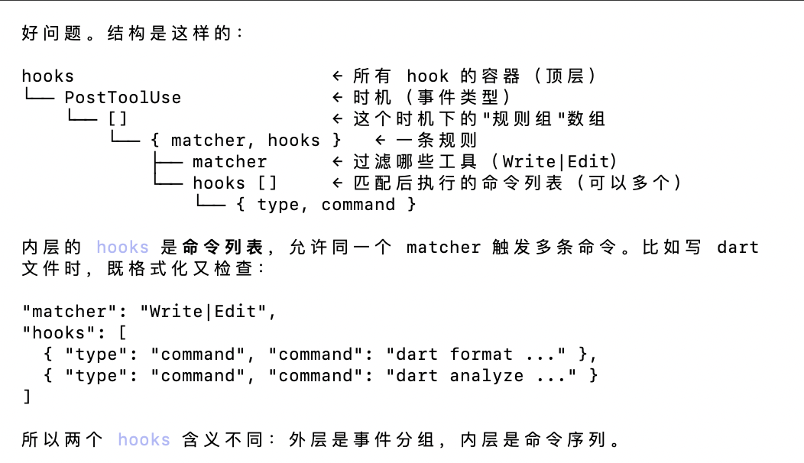

hooks

```json
{
  "hooks": {
    "PostToolUse": [
      {
        "matcher": "Write|Edit",
        "hooks": [
          {
            "type": "command",
            "command": "FILE=$(jq -r '.tool_input.file_path'); if [[ -f \"$FILE\" && \"$FILE\" == *.dart ]]; then dart format \"$FILE\"; fi"
          }
        ]
      }
    ]
  }
}
```




#### UserPromptSubmit

❯ 我不明白每次提问前，自动把当前 `pubspec.yaml` 的依赖版本注入上下文有什么实际  

 意义。把当前分支、环境信息、文件内容塞进去又有什么实际意义？实际 flutter    开发中检测到敏感内容可以直接 block，Claude                   根本收不到这条消息，又有啥实际意义？或者你给我举一个真正有意义的案例      

​                                    

⏺ **claude-code-guide**(Research real-world UserPromptSubmit hook use cases)     

 ⎿  Done (10 tool uses · 14.6k tokens · 45s)                  

 (ctrl+o to expand)           

​                                         

⏺ 你的质疑是对的，那三个例子确实比较虚。让我给你一个真正有意义的案例。      

​                                         

 \---                                      

 **场景：你在 Flutter 项目里问 Claude "帮我加一个网络请求"**            

​                                         

 没有 hook 时，Claude 可能建议你用 http 包，但你项目里其实已经用了       

 dio，还配了拦截器、统一的错误处理、token 刷新逻辑。Claude           

 不知道这些，给出的代码要么用错包，要么绕过了你已有的架构。           

​                                         

 你只能手动粘贴相关代码给它，或者在 prompt 里说"我用的是            

 dio，有拦截器"。每次都要重复这个动作。                     

​                                         

 有了 UserPromptSubmit hook，每次提问前自动执行：                

​                                         

 echo "当前依赖：$(grep -A2 'dio\|retrofit\|http' pubspec.yaml)"        

 echo "网络层入口：$(cat lib/core/network/dio_client.dart)"           

​                                         

 把这些注入进去，Claude                             

 每次都知道你的网络层长什么样，直接给出符合你项目架构的代码。          

​                                         

 \---                             

 **关键点在于：这是动态变化的内容**     

​                                         

 \- pubspec.yaml 你随时在改，CLAUDE.md 里写死的版本会过期

 \- dio_client.dart 你可能上周刚重构过，Claude 不知道              

 \- 当前 git branch 决定了你在做哪个功能，影响 Claude 给建议的方向        

​                                         

 CLAUDE.md 适合写**稳定不变的规范**，UserPromptSubmit                

 适合注入**随时在变的当前状态**。这是两者真正的分工。


## 二、解决一个实际问题：报价表处理

#### 5、Plugin

> 我们也可以打包成自己的 plugin，比如把 figma mcp、写 ui 的 skill或 subagent 打包起来，搞成一个工作流，但这个工作流似乎应该放在第三篇里实现，不过这里演示打包 plugin 的案例时就可以为工作流做准备了

######  打包流程

* **1. 创建 plugin 目录结构**

```
 my-purchase-plugin/                                                  
 ├── plugin.json     # plugin 元数据/清单                                      
 ├── agents/                                                       
 │  ├── merge-quotes.md # 你的合并报价表 agent                                     
 │  └── calc-price.md  # 你的计算售价 agent                                      
 ├── skills/       # 可选，slash commands
 ├── mcp-servers/  # 可选，工具
 └── hooks/        # 可选，自动化钩子
```

* **2. 编写** **plugin.json**

```json
{
  "name": "purchase-quote-tools",
  "version": "1.0.0",
  "description": "采购报价表处理工具：合并报价表 + 计算售价",
  "author": "你的名字",
  "components": {
    "agents": [
      "agents/merge-quotes.md",
      "agents/calc-price.md"
    ]
  }
}
```

* **3. 分发方式**

```
- 本地目录：直接把整个目录发给别人（我们演示下本地）
- Git 仓库：推到 GitHub，别人从 URL 安装
- Plugin 市场/registry（社区在建


Add Marketplace Enter marketplace source:
* 1、官方的维护的插件市场已经默认给 cc 安装上去了（其实也是一个 git 仓库）
* 2、现在开源的插件市场基本都是以 git 仓库的形式提供的，我们可以给我们的 cc 安装这些插件市场
	* HTTPS 的话：claude plugin marketplace add ${仓库地址 https://github.com/dontbesilent2025/dbskill.git 里的 owner/仓库名 部分：dontbesilent2025/dbskill}
	* SSH 的话：claude plugin marketplace add ${仓库的完整地址：git@github.com:dontbesilent2025/dbskill.git}
* 3、我们自己的维护的插件市场，可以 git 安装、可以本地安装，git 安装的话就是上面那样、本地安装的话如下：
  * 本地的话：claude plugin marketplace add ${pluginplaces 目录的绝对路径或相对路径都行}
```

* **4. 搞个本地本地插件市场**

**plugin install 只支持从 marketplace 安装，不支持直接指定本地路径。**所以本地路径插件需要先把所有插件的共同父目录注册为 marketplace，再安装，流程是：

```json
// 在 所有插件的共同父目录下创建一个 .claude-plugin 目录，在 .claude-plugin 目录下创建一个 marketplace.json 文件，填写内容：
{
  "name": "my-plugins",
  "owner": {
    "name": "local"
  },
  "plugins": [
    {
      "name": "my-purchase-plugin",
      "source": "./my-purchase-plugin"
    }
  ]
}
```

配置好后，先给 Claude Code 添加这个插件市场：

```shell
claude plugin marketplace add ${pluginplaces 的绝对路径}

# 安装好之后启动 claude，输入 /plugins - marketplaces 应该能看到本地市场
```

###### 安装流程（使用者侧）**

```bash
# 启动 claude 后，从本地目录安装(一定要注意 plugin 的作用域)                        
claude plugin install ${plugin 的绝对路径} # 默认把 plugin 安装到用户级
claude plugin install --scope user ${plugin 的绝对路径} # 同上
claude plugin install --scope project ${plugin 的绝对路径} # 项目级，可提交 git
claude plugin install --scope local ${plugin 的绝对路径} # 项目级，不可提交 git
```

安装 plugin 后，其实就把打包在其中的 mcp servers、hooks、subagents、skills 给拿出来再放到到相应的目录，就好像被分享者自己写的这些东西一样，可以愉快地使用了。


```
claude plugin install xxx@version   # 安装 / 回滚
claude plugin update xxx            # 升级
claude plugin uninstall xxx         # 删除
```

***

Skills 通过 plugin 体系分发，plugin 市场即 skill 市场：[官方 plugin 市场](https://github.com/anthropics/claude-plugins-official)（已内置）、[GitHub 搜索](https://github.com/)，这里以 skill-creator 这个 plugin 为例，它包含一个用来创建和优化 skill 的 skill

###### 2.1 安装

**① 方式一：手动创建 SKILL.md 文件，注意作用域**

我们只需要在相应【存储位置】下创建 `${skill-name}/SKILL.md` 文件即可。一定要想清楚把这个 skill 安装到什么作用域，别把环境搞得乱七八糟，这里选择安装到项目级

```markdown
<!-- ${root}/.claude/skills/my-skill/SKILL.md -->

---
name: my-skill
description: 触发条件描述，Claude 根据这个决定是否调用该 skill
---

# skill 的具体指令内容...
```

**② 方式二：执行 shell 命令安装 plugin，注意作用域**

Skills 通过 plugin 体系分发，我们只需要执行 shell 命令，Claude Code 就会自动把 skill 文件放到相应【存储位置】里。一定要想清楚把这个 plugin 安装到什么作用域，别把环境搞得乱七八糟，这里选择安装到用户级

```shell
# 第一步：添加 plugin 市场（官方市场已内置，无需添加；第三方市场需手动添加）
# HTTPS 方式
claude plugin marketplace add ${owner/repo}
# SSH 方式
claude plugin marketplace add ${git@github.com:owner/repo.git}
# 本地目录方式
claude plugin marketplace add ${/path/to/plugins-dir}

# 第二步：安装 plugin（skill 随之落地到相应存储位置）
# 安装到用户级（默认）
claude plugin install ${plugin-name}@${marketplace-name}
claude plugin install ${plugin-name}@${marketplace-name} --scope user

# 安装到项目级
claude plugin install ${plugin-name}@${marketplace-name} --scope project

# 安装到本地级
claude plugin install ${plugin-name}@${marketplace-name} --scope local
```

**③ 确认一下 skill 是否安装成功**

无需重启 Claude Code，执行 `claude skills list` 命令应该就能看到我们刚安装的 skill 了